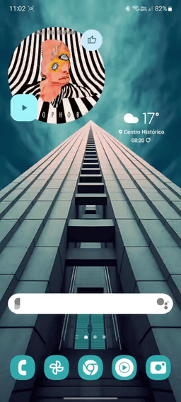

# ChatLaunch for WhatsApp

Small application designed to start conversations via whatsapp without the need to add the number to your contact list.
The application is developed in Jetpack Compose and uses the whatsapp API to start the chat.

## Demo

You can start the chat via

Quick settings tile            |  App icon
:-----------------------------:|:-------------------------:
  |  

## Installation

Download the latest APK [here](https://github.com/theolm/WhatsAppNoContact/releases/latest/download/app-release.apk
) or go into the [release](https://github.com/theolm/WhatsAppNoContact/releases/latest/) page and download the desired version. Just install the APK and it should work.

The app requires Android 7 or higher and WhatsApp installed.
